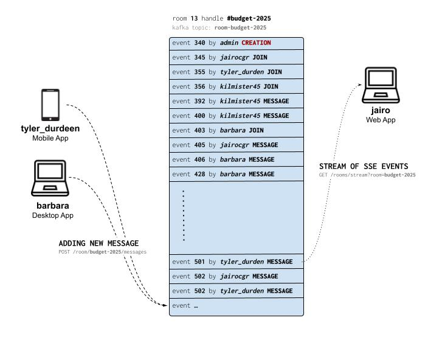

# Chat Live

This project implements a hypothetical live chatting system.

The idea is that **users** send **messages** to **chat rooms** and their clients are notified anytime new messages are published or new users **join** those rooms.

## The Solution to The Challenge

The solution is a monolithic backend app that implements a client-server architecture, where the server is the central single source of truth where all messages, rooms, and users are stored.


The client is responsible for user log-in, message sending, and keeping in their local storage all messages and events read, so the user can scroll up to read past messages in a responsively and scalable manner.

### Chat Room as an Event Log

The core semantics of this solution are _events_ (more precisely, **room events**). **Creation** of a room, new **messages** and user **joining** are conceptualy just **events** that happens inside of a **room**.

A room can be thought of then as nothing more than a [_write once read many_](https://en.wikipedia.org/wiki/Write_once_read_many) stream of events, where new events are added to the tail end and are never removed.

With this core idea, the client's job is to listen to new events published in those [_append-only_](https://en.wikipedia.org/wiki/Append-only) event streams called rooms and update the user view, so it is always up to date on what going on in those rooms.

A room as an event log can also be thought of as a _UNIX_ file that is constantly appended and the client's role is to both `tail --follow` it and `echo` append it.

#### The Event Log Powered by Kafka

Since, in this metaphor, the rooms are just an event stream, a combination of **PostgreSQL** and **Apache Kafka** to both persist and broadcast those events comes naturally.

In this solution, **Kafka** is used for buffering new messages sent by the clients and — once those messages are ingested and stored in the **PostgreSQL** database — to keep room events in long-lived topics.

> We rely on the [**Outbox Pattern**](https://microservices.io/patterns/data/transactional-outbox.html) to publish the room events to Kafka after they are stored in the database.



## Stack of Choice

The heart of the solution is the use of the event streaming platform **Apache Kafka**.

This project was written using **Java 17**, **Spring Boot**, and **PostgreSQL 16** is the _RDBMS_ of choice.

The project also uses **Redis** as a [**SchedLock**](https://github.com/lukas-krecan/ShedLock) distributed lock provider.

The code was written using _TDD_ and _DDD_ and the persistence layer of choice was **Spring JPA**.

## Domain

The core concepts in this project are:

* **User** could be `ADMIN` or common `USER`, both can join rooms and send messages.
* **Room** where all the chatting happens, can have many members (the concept in theory could be expanded to engulf private chatting, where you would have a special type of room that would only support two members).
* **Message** message is just the content of a specific type of **Room Event**.
* **Room Event** is a thing that happens inside a room, can be of a type `CREATION` that happens when the room is created and is the first event in a room, `JOIN` when a user joins a room, and `MESSAGE` carrying the message content sent by a user.

## User Auth

Apart from login and those Swagger endpoints, every endpoint must be **Basic Authenticated**.

**Spring Security** is used to authenticate the requests and the passwords are stored as a `bcrypt` hash.

All authenticated users can list the available chat rooms, read and join them, but only room members can publish new messages to a room.

For simplicity's sake, only users with the role `ADMIN` are allowed to create users and new rooms.

## How to Run

The most straightforward way to run this project is via `docker-compose`.

First, run the **PostgreSQL**, **Kafka** and **Redis** containers:

```bash
docker compose up db kafka redis
```

Then build and run the app container:

```bash
docker-compose up app --build
```

The app container is built in a multi-staged build. The project is built using a maven image and then the artifact is copied to an Eclipse JRE image which will run it.

### Using Maven

You can also run the application using the Spring Boot command:

```bash
# Create the .env file
cp .env.example .env

# Run it
mvn spring-boot:run
```

### Swagger and Postman

Once the app is running, you can check the Swagger API documentation [http://localhost:8080/swagger-ui/index.html](http://localhost:8080/swagger-ui/index.html).


## How to Test

To run the unit tests you can use Maven:

```bash
mvn clean test
```

### Integration Tests

The project also has integration tests that can be run alongside the unit tests:

```bash
mvn clean verify
```

The integration tests are in the `src/integration-test` directory, and they hit real **PostgreSQL**, **Kafka**, and **Redis** instances running using [Testcontainers](https://testcontainers.com).

## First Run + User and Room Creation

When you boot the application for the first time, it will try to migrate the database using [Flyway](https://flywaydb.org).

The migrations, besides creating all the necessary schemes and tables, will also:

1) Create the `admin` user (password `admin`) that must be used to create new users and rooms, and
1) create the `general` room where all users join once they're created.

> To change the `admin` password, or every other user for that matter, you just need to put a new [`bcrypt`](https://bcrypt.online) hash in the column `password` at the `live.user` table.

### Create a New User

To create a new user you have to send a `POST /users` **Basic Authenticated** with the `admin` credentials.

### Create a New Room

To create a new room you have to send a `POST /login` **Basic Authenticated** with the `admin` credentials.

## The Client-Server Protocol

Imagining a hypothetical chat client, the first step is for the user to log in with their username and password.

After you authenticate the user, the client will start to listen to the rooms that the user is a member of, and the client can render what's going on in those rooms.

### User Login

The user login is done via the `POST /user/login` endpoint passing the user credentials in the request body.

The login endpoint will return data about the authenticated user and the list of chat rooms that he joined.

### List and Join a Room

With the user credential on the header, you can get all the available rooms and their members by hitting `GET /rooms`.

The user must join a given chat room by `POST /room/:handle/join` with his credentials.

### Publishing a New Message

To send a message to a room, use `POST /room/:handle/messages`.

This is an asynchronous endpoint, so new messages will be queued, processed in the background, and published to the room stream of events.

### Listening to Room Events

To follow up on what's going on in a chat room `GET /rooms/stream?room={handle}`.

This endpoint will return a stream of [Server-sent Events (SSE)](https://en.wikipedia.org/wiki/Server-sent_events) so the client stays up-to-date about a room or a set of rooms.

If you pass multiple `room` params listing all rooms that you want to follow, this endpoint can be used to get events from multiple rooms in a single TCP connection.

When you call this endpoint, it will always return the last `prefetch` number of events of the rooms specified. This can come at hand when the client needs to render a room for the first time.

### Get Older Events

If the client needs to rollback the tape of events of a given room — to provide the end-user the scroll-up feature to see older messages for instance — it must `GET /room/:handle/events/before?oldestId={oldestKnownId}`.

This endpoint will return at most 64 events that happened before the oldest known event ID the client knows about.

The client can call this endpoint passing the older IDs until it receives the genesis event of type `CREATION`, signaling that there aren't events anymore.

### Get New Events

If the client stops following the events — when it loses the connection, or the user just closes the app — it can catch up on what's is missing by calling `GET /room/:id/events/after?lastKnownId={lastKnownId}`.

This feature is prime for the client to synchronize its local database with the server's.

## What is Missing to be a Production-Ready Solution?

I think that — apart from functional features like room deletion, user management, and private chatting — some non-functional features come to mind:

* Spring Boot **Actuator** should be active so the app can be properly observed and health checked in production.
* Bether authentication with [JWT](https://jwt.io/introduction).
* Some basic rate limiting and some backpressure mechanisms.
* End-to-end system testing with rest assured.
* Better use of **OpenAPI**-specific annotations to better document
* High-grade structured logging with **SLF4J**.
* Support to an APM agent like the **NewRelic** one.
* Better global exception handling with proper logging and reporting to an error catcher or APM tool.

## How to Scale this Solution?
I think that for the use case of a live chatting server, this solution is already fairly scalable.

Live chatting is throttled by nature  — users need time to read, think, devise a response, and write a reply.

The challenging part of a chatting system is the event broadcasting. Each message published has to be read by hundreds of users in a short time.

This solution tried to tackle this central problem by:

1) Providing a stream of **Server-sent Events (SSE)** to the client so it doesn't have to [poll](https://en.wikipedia.org/wiki/Polling_(computer_science)), and
1) to do that streaming, relying on **Kafka**, a horizontally scalable and mighty fast for sequential reads database.

We can scale this solution by having a big enough **Kafka Cluster**, and an elastic number of application instances to keep a large number of TCP connections streaming the events to the clients.

We can also keep multiplies fine-tuning **PostgreSQL Read-Replicas** with large memory banks available for caching. Materialized views for each room could be great.

We can also change the client-server protocol so that the client would solely rely on Kafka to browse past and future events instead of querying a PostgreSQL instance.

### PostgreSQL as a Writing Bottleneck

The bottleneck of this solution is the PostgreSQL database, more specifically the `live.room_events` table where all messages are stored.

Once we spin up replicas to offload queries, we can optimize the main instance by using performant SSD disks and separate different disks for WAL (Write-Ahead Logging) and data storage.

Multi-tenancy is another solution that might work. We could logically separate users and rooms between different "chat servers" (or tenants) like Slack and Discord do. This logical separation can afford us the possibility to isolate the physical infrastructure of each chat server, which would mean smaller databases working separately with less concurrent writing.


